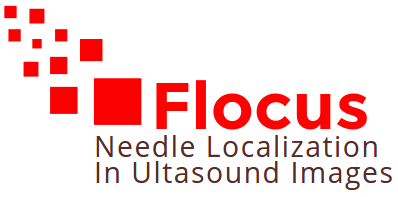

Flocus stands for __Full needle LOCalization in UltraSound images__.

The repository contains various algorithm for image processing based on data acquired by a [SonixTouch](http://www.ultrasonix.com/wikisonix/index.php/SonixTOUCH) ultrasound machine.

Neccessary data can be provided on demand. 

This project is included in the CAMI labex.

## Environment

The project require qt and opencv. (It has been tested with qt5 and opencv2.4.) 
